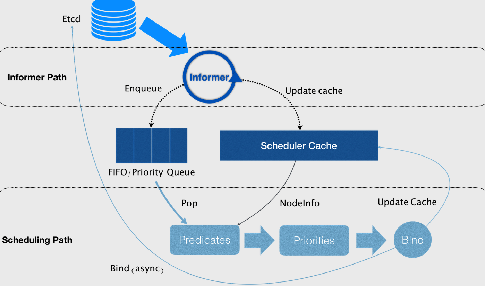

# kube-scheduler
kube-scheduler的作用是根据待调度pod列表、可用node列表、以及调度算法/策略，将待调度pod绑定到某个合适的node上（将pod的spec.nodeName字段填上调度结果的节点名字），并将绑定信息写入etcd。

## 调度原理

### 总体架构

- 第一个控制循环是Informer Path，用于监听（Watch）Etcd 中 Pod、Node、Service 等与调度相关的 API 对象的变化。比如，当一个待调度 Pod（即：它的 nodeName 字段是空的）被创建出来之后，调度器就会通过 Pod Informer 的 Handler，将这个待调度 Pod 添加进调度队列。同时，k8s默认调度器还要负责对调度对象进行缓存。
- 第二个控制循环是调度器负责 Pod 调度的主循环，我们可以称之为 Scheduling Path，它不断地从调度队列里出队一个 Pod。然后，调用 Predicates 算法进行node“过滤”（Predicates 算法需要的 Node 信息，都是从 Scheduler Cache 里直接拿到的）。再调用 Priorities 算法为上述列表里的 Node 打分，得分最高的 Node就会作为这次调度的结果。调度算法执行完成后，调度器就需要将 Pod 对象的 nodeName 字段的值，修改为上述 Node 的名字，这个步骤在k8s里面被称作 Bind。

### 调度算法

#### Predicates

Predicates 在调度过程中的作用，可以理解为 Filter，即：它按照调度策略，从当前集群的所有节点中，“过滤”出一系列符合条件的节点。这些节点，都是可以运行待调度 Pod 的宿主机。

当开始调度一个 Pod 时，scheduler会同时启动 16 个 Goroutine，来并发地为集群里的所有 Node 计算 Predicates，最后返回可以运行这个 Pod 的宿主机列表。每个 Node 执行 Predicates 会按照固定的顺序来进行执行不同的调度策略，其中的策略包括：GeneralPredicates、与 Volume 相关的过滤规则、宿主机相关的过滤规则、Pod 相关的过滤规则。

#### Priorities

Priorities 阶段的工作就是为这些节点打分，得分最高的节点就是最后被 Pod 绑定的最佳节点。其中打分规则包含：LeastRequestedPriority、BalancedResourceAllocation、NodeAffinityPriority、TaintTolerationPriority 和 InterPodAffinityPriority。

可以通过为 kube-scheduler 指定一个配置文件或者创建一个 ConfigMap ，来配置哪些规则需要开启、哪些规则需要关闭。并且，通过为 Priorities 设置权重来控制调度器的调度行为。

### Preemption

Preemption就是当一个高优先级的 Pod 调度失败后，该 Pod 并不会被“搁置”，而是会“挤走”某个 Node 上的一些低优先级的 Pod ，从而保证这个高优先级 Pod 的调度成功。

