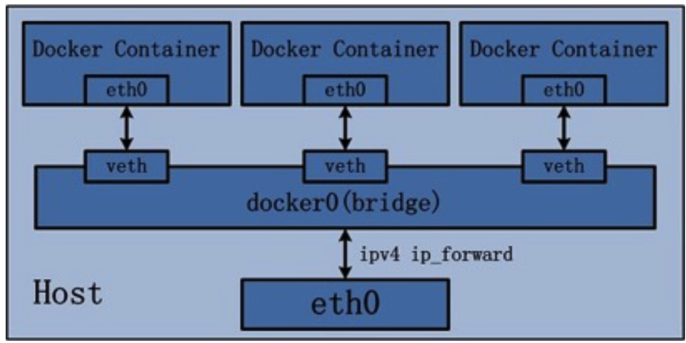

# Network
## Intra-Host Network
### None

容器启动时创建Network Namepace，但不配置任何网络功能，以--net=none参数启动容器。容器启动后可以为容器配置网络。

```bash
$ docker run --net=none ubuntu:xenial ip addr show
1: lo: <LOOPBACK,UP,LOWER_UP> mtu 65536 qdisc noqueue state UNKNOWN link/loopback 00:00:00:00:00:00 brd 00:00:00:00:00:00
inet 127.0.0.1/8 scope host lo
valid_lft forever preferred_lft forever inet6 ::1/128 scope host
valid_lft forever preferred_lft forever
```


### Container Network

不创建Network Namepace，加入另一个运行中的容器的Network Namespace，以--net=container:<容器id>参数启动容器。k8s中的Pod就是基于container network健力的。

```bash
$ docker run -ti -d tlinux-64bit-v2.2.20170418:latest bash
7e01a70419e7370536f1f7673d0454184cab1db1f179d352d9463d80c4adb42e
$ docker run --net=container:7e01a70419e7 -ti -d tlinux-64bit- v2.2.20170418:latest bash 11ab481ed4787b6084dce73314ae37250a55ba717de6784c3281a7462ed39478 
$ docker inspect --format '{{.State.Pid}}' 11ab481ed478
13536
$ docker inspect --format '{{.State.Pid}}' 7e01a70419e7
12630
$ ls -l /proc/13536/ns/net
/proc/13536/ns/net -> net:[4026532355] 
$ ls -l /proc/12630/ns/net /proc/12630/ns/net -> net:[4026532355]
```

- `docker run -d -it --name=CT_ID ubuntu:xenial`
- `docker run -d -it --network=container:CT_ID ubuntu:xenial`: the containers share the same network stack

### Host

不创建Network Namepace，共享主机的Network Namespace，以--net=host参数启动容器。但是安全问题，容器可以操纵主机的网络配置。

```bash
$ docker run --net=host -ti -d tlinux-64bit-v2.2.20170418:latest bash
b55213be4c805925ecc4dc1bd7934a01dde6f085313e395777c137b957d91a05
$ docker inspect --format '{{.State.Pid}}' b55213be4c80
22865
$ ls -l /proc/1/ns/net
/proc/1/ns/net -> net:[4026531957]
$ ls -l /proc/22865/ns/net 
/proc/22865/ns/net -> net:[4026531957]
```


- `docker run -it --network=host ubuntu:xenial`: container and host share the same network stack
  - for the reason of performance 
  - use the container to config the host network stack

### Bridge

Docker设计的NAT网络模型，创建新Network Namepace，配置docker0网桥，创建、配置对应的veth pair，依赖iptables规则，以--net=bridge参数启动容器。

容器之间通过docker0网桥实现互访，容器通过iptable NAT功能访问外网，同时容器通过宿主机端口映射对外暴露服务。



- `docker network list`: list all the networks
- `docker network inspect NET_ID`: show detailed information
- `docker network create NET_ID`: create
  - `docker network create -d DRIVER NET_ID`: specify the network driver to use, by default we use the Bridge
- `docker network rm NET_ID`: remove
- `docker container run --name ct1 -it --rm --net=NET_ID ubuntu:xenial`: launch a CT in a network
- `docker network connect NET_ID CT_ID`: connect a CT to a network, one CT can be connected to multiple networks
- `docker network disconnect NET_ID CT_ID`: disconnect


## Lab
### VM-VM Ping
- in the host：
```bash
docker network create net1
docker container run --name ct1 -it -d --net=net1 ubuntu:xenial
docker container run --name ct2 -it --net=net1 ubuntu:xenial /bin/bash
```
- in the container `ct2`: 
```bash
apt update
apt install iputils-ping
ping ct1
```
