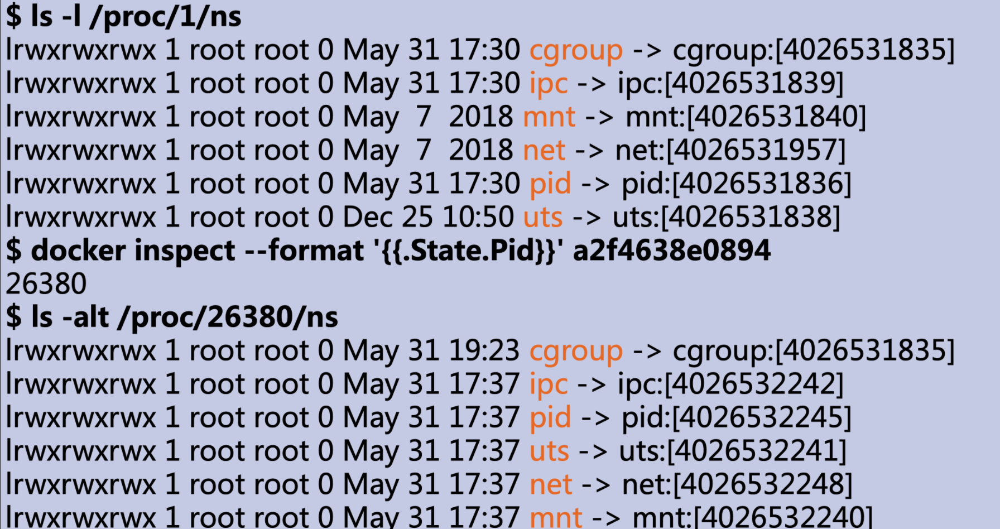

# Namespace

## 简介

Namespace是Linux用来隔离系统资源的方式，它使得PID、IPC、Network等系统资源不再是全局性的，而是属于特定的namespace，其中的进程好像拥有独立的“全局”系统资源。每个namespace里面的资源对其他namespace都是彼此透明，互不干扰，改变一个namespace中的系统资源只会影响当前namespace里的进程，对其他namespace中的进程没有影响。

在原先Linux中，许多资源是全局管理的。例如，系统中的所有进程按照惯例是通过PID标识的，这意味着内核必须管理一个全局的PID列表。而且，所有调用者通过uname系统调用返回的系统相关信息（包括系统名称和有关内核的一些信息）都是相同的。用户ID的管理方式类似，即各个用户是通过一个全局唯一的UID号标识。Namespace提供了一种不同的解决方案，前面所述的所有全局资源都通过namespace封装、抽象出来。本质上，namespace建立了系统的不同视图，此前的每一项全局资源都必须包装到namespace数据结构中。Linux系统对简单形式的命名空间的支持已经有很长一段时间了，主要是chroot系统调用。该方法可以**将进程限制到文件系统的某一部分**，因而是一种简单的namespace机制，但真正的命名空间能够控制的功能远远超过文件系统视图。

新的namespace可以用下面3种方法创建：

- 在用fork或clone系统调用创建新进程时，有特定的选项可以控制是与父进程共享命名空间，还是建立新的命名空间。
- setns系统调用让进程加入已经存在的namespace，Docker exec就是采取了该方法。
- unshare系统调用让进程离开当前的namespace，加入到新的namespace中。

在进程已经使用上述的3种机制之一从父进程命名空间分离后，从该进程的角度来看，改变全局属性不会传播到父进程命名空间，而父进程的修改也不会传播到子进程。而对于文件系统来说，情况就比较复杂，其中的共享机制非常强大，带来了大量的可能性。

## 实现

Namespace的实现需要两个部分：每个子系统的namespace结构，将此前所有的“全局”系统包装到namepsace中；将给定进程关联到所属各个namespace的机制。

系统此前的全局属性现在封装到namespace中，每个进程关联到一个选定的namespace。struct nsproxy用于汇集指向特定于namespace的指针：

struct nsproxy { 

        atomic_t count; 
        struct uts_namespace *uts_ns; 
        struct ipc_namespace *ipc_ns; 
        struct mnt_namespace *mnt_ns; 
        struct pid_namespace *pid_ns; 
        struct user_namespace *user_ns; 
        struct net *net_ns; 

};

## PID Namespace

当调用clone时设定了CLONE_NEWPID，就会创建一个新的PID namespace，clone出来的新进程将成为namespace里的第一个进程。一个PID namespace为进程提供了一个独立的PID环境，PID namespace内的PID将从1开始，在namespace内调用fork、vfork或clone都将产生一个在该namespace内独立的PID。新创建的namespace里的第一个进程在该你namespace内的PID将为1，就像一个独立的系统里的init进程一样。该namespace内的其他进程都将以该进程为父进程，当该进程被结束时，该namespace内所有的进程都会被结束。

PID namespace是层次性，新创建的namespace将会是创建该namespace的进程属于的namespace的子namespace。子namespace中的进程对于父namespace是可见的，一个进程将拥有不止一个PID，而是在所在的namespace以及所有直系祖先namespace中都将有一个PID。系统启动时，内核将创建一个默认的PID namespace，该namespace是所有以后创建的namespace的祖先，因此系统所有的进程在该namespace都是可见的。

## IPC Namespace

当调用clone时，设定了CLONE_NEWIPC，就会创建一个新的IPC namespace，clone出来的进程将成为namespace里的第一个进程。一个IPC namespace有一组System V IPC objects标识符构成，这标识符由IPC相关的系统调用创建。在一个IPC namespace里面创建的IPC object对该namespace内的所有进程可见，但是对其他namespace不可见，这样就使得不同namespace之间的进程不能直接通信，就像是在不同的系统里一样。当一个IPC namespace被销毁，该namespace内的所有IPC object会被自动销毁。

PID namespace和IPC namespace可以组合起来一起使用，只需在调用clone时，同时指定CLONE_NEWPID和CLONE_NEWIPC，这样新创建的namespace既是一个独立的PID空间又是一个独立的IPC空间。不同namespace的进程彼此不可见，也不能互相通信，这样就实现了进程间的隔离。

## Mount Namespace

当调用clone时，设定了CLONE_NEWNS，就会创建一个新的mount namespace。每个进程都存在于一个mount namespace里面，mount namespace为进程提供了一个文件层次视图。如果不设定这个flag，子进程和父进程将共享一个mount namespace，其后子进程调用mount或umount将会被该namespace内的所有进程看见。如果子进程在一个独立的mount namespace里面，就可以调用mount或umount建立一份新的文件层次视图，mount、unmount只有该namespace可以看见。该flag配合chroot、pivot_root系统调用，可以为进程创建一个独立的目录空间，chroot实现目录独享、mount namespace实现挂载点独享。

## Network Namespace

当调用clone时，设定了CLONE_NEWNET，就会创建一个新的Network namespace。一个Network namespace为进程提供了一个完全独立的网络协议栈的视图，包括网络设备接口、IPv4和IPv6协议栈、IP路由表、防火墙规则、sockets等。一个Network namespace提供了一份独立的网络环境，就跟一个独立的系统一样。一个物理设备只能存在于一个Network namespace中，但可以从一个namespace移动另一个namespace中。虚拟网络设备（virtual network device）提供了一种类似管道的抽象，可以在不同的namespace之间建立隧道。利用虚拟化网络设备，可以建立到其他namespace中的物理设备的桥接。当一个Network namespace被销毁时，物理设备会被自动移回初始的Network namespace，即系统最开始的namespace。

## UTS Namespace

当调用clone时，设定了CLONE_NEWUTS，就会创建一个新的UTS namespace，即系统内核参数namespace。一个UTS namespace就是一组被uname返回的标识符。新的UTS Namespace中的标识符通过复制调用进程所属的namespace的标识符来初始化。Clone出来的进程可以通过相关系统调用改变这些标识符，比如调用sethostname来改变该namespace的hostname。这一改变对该namespace内的所有进程可见。CLONE_NEWUTS和CLONE_NEWNET一起使用，可以虚拟出一个有独立主机名和网络空间的环境，就跟网络上一台独立的主机一样。

## 总结

每个Linux中的进程都包含以上多种namespace，可以通过``ls -alt /proc/PID/ns``来查看。以上所有clone flag都可以一起使用，为进程提供了一个独立的运行环境。LXC正是通过clone时设定这些flag，为进程创建一个有独立PID、IPC、mount、Network、UTS空间的容器。一个容器就是一个虚拟的运行环境，但对容器里的进程是透明的，它会以为自己是直接在一个系统上运行的。容器实际上是在创建容器进程时，指定了这个进程所需要启用的一组namespace参数，这样容器进程就只能“看”到当前namespace所限定的资源、文件、设备、状态，或配置。而对于宿主机以及其他不相关的应用，它就完全看不到了。这时，容器进程就会觉得自己是各自PID namespace里的第1号进程，只能看到各自Mount namespace里挂载的目录和文件，只能访问到各自Network namespace里的网络设备，就仿佛运行在一个“容器”里面。

Linux namespaces机制本身就是为了实现“容器虚拟化”开发的，它实际上修改了应用进程看待整个系统资源的“视图”，即它的“视线”被namespace统做了限制，只能看到某些指定的内容。但对于宿主机来说，这些被“隔离”了的进程跟其他进程并没有太大区别。所以namespace提供了一套轻量级、高效率的系统资源隔离方案，远比传统的虚拟化技术开销小。不过它也不是完美的，它为内核的开发带来了更多的复杂性，它在隔离性和容错性上跟传统的虚拟化技术比也还有差距。

## 操作

- 列出某个PID所在的所有namespace：

## Ref

- [Linux Namespaces机制](http://blog.chinaunix.net/uid-28541347-id-4370991.html)