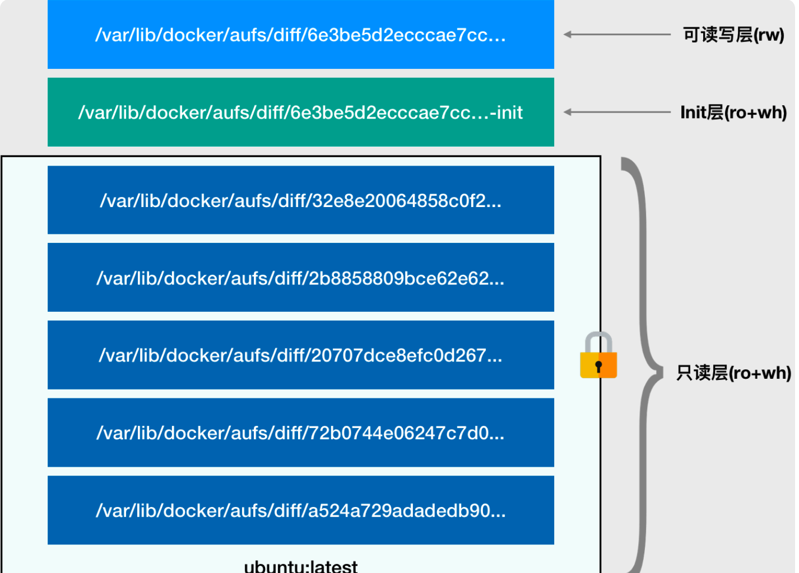
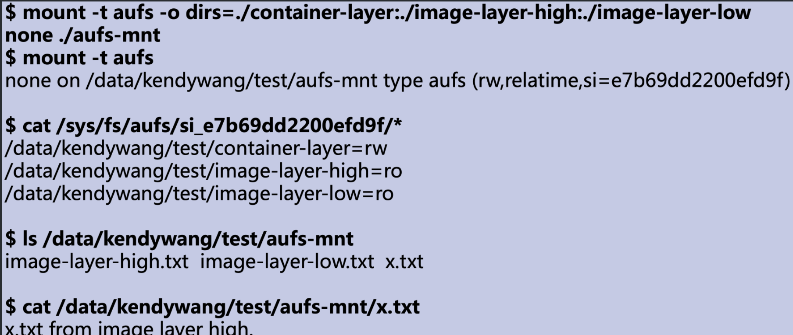
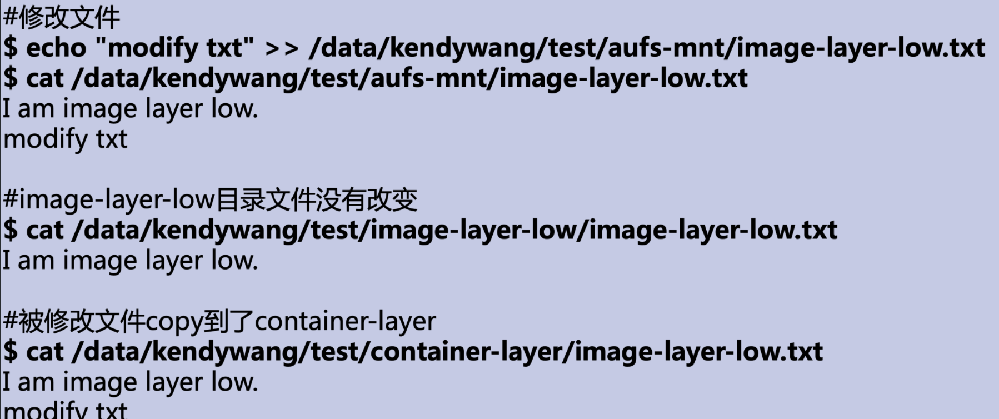
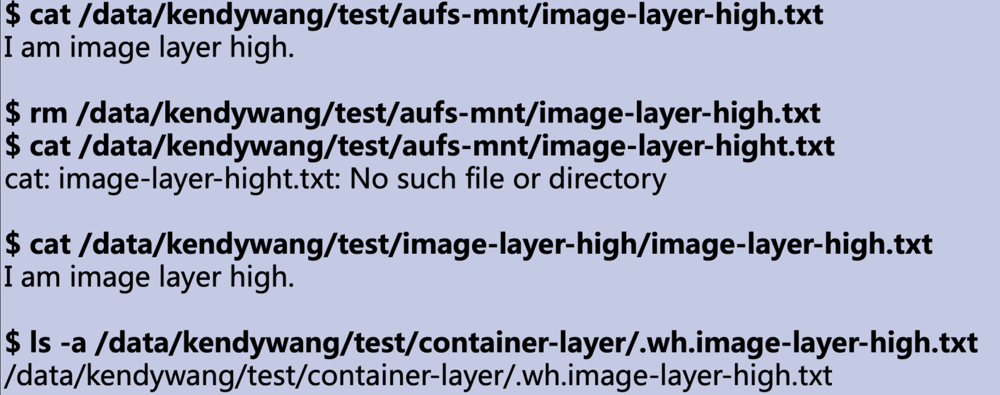

# rootfs

  ## 简介

  从文件隔离的角度，希望新建容器进程看到的文件系统就是一个独立的隔离环境，而不是继承自宿主机的文件系统。在Linux里有个chroot的命令，它的作用就是“change root file system”，即改变进程的根目录到指定的位置。因为容器就是一个进程，所以可以通过chroot给容器进程提供一个新的根目录及新的文件系统。为了能够让容器的根目录看起来更像一个真实的操作系统，一般会在该容器启动的时候在其根目录下挂载一个完整操作系统的文件系统，比如Ubuntu16.04的ISO。这样在容器启动之后，在容器内执行 "ls /"就可以查看到整个根目录下的内容，也就是Ubuntu 16.04的所有目录和文件。

  这个挂载在容器根目录上、用来为容器进程提供隔离后执行环境的文件系统，就是容器镜像，被称为rootfs（根文件系统）。rootfs只是一个操作系统的文件系统那个，包含文件、配置和目录等，但并不包括操作系统内核。Linux操作系统只有在开机启动时才会加载指定版本的内核镜像到内存中。rootfs只包括了操作系统的文件系统，并没有包括操作系统的内核。同一台宿主机上的所有容器，都共享宿主机操作系统的内核。这就意味着如果容器中的应用程序需要配置内核参数、加载额外的内核模块，以及跟内核进行直接的交互，这些操作都是对宿主机操作系统的内核的操作，它对于该宿主机上的所有容器来说是全局的。

  正是由于rootfs的存在，容器才**有了运行环境的一致性**。由于rootfs里打包的不只是应用，而是整个操作系统的文件和目录，因此应用以及其所需依赖都被封装在了一起。有了容器镜像“打包操作系统”的能力，应用的依赖环境也终于变成了应用沙盒的一部分。这就赋予了容器所谓的一致性：无论在本地、云端，还是在任何一台宿主机上，只需要解压打包好的容器镜像，那么这个应用运行所需要的完整的执行环境就可以被重现。这种深入到操作系统级别的运行环境一致性，打通了应用在本地开发和远端执行环境之间难以逾越的鸿沟。

  ## UnionFS/ aufs

  Docker镜像的制作并没有沿用以前制作rootfs的标准流程，而是在镜像的设计过程中引入了层（layer）的概念。用户制作镜像的每一步操作，都会生成一个层，整个文件系统增量机制是基于UnionnFS的能力。UnionFS是Linux内核中的一项技术，它将多个不同位置的目录联合挂载到同一个目录下。而Docker就是利用这种联合挂载的能力，将容器镜像里的多层内容呈现为统一的rootfs。Docker中使用到的UnionFS的实现是aufs，虽然aufs还未进入Linux内核主干，但是在Ubuntu、Debain等发行版上均有使用。

  ### 镜像分层

  

  以Docker为例，其镜像主要分为3层：

  - 只读层：容器的rootfs最下面的五层，以增量的方式分别包含了整个文件系统。
  - 读写层：容器的rootfs最上面的一层，在没有写入文件之前，这个目录是空的。而一旦在容器里做了写操作，修改产生的内容就会以增量的方式出现在这个层中。可读写层的作用就是专门用来存放修改rootfs后产生的增量，无论是增、删、改。当使用完了这个被修改过的容器之后，还可以使用docker commit和push指令保存这个被修改过的可读写层。而与此同时，原先的只读层里的内容则不会有任何变化，这就是增量rootfs的好处。
  - init层：Docker/k8s单独生成的一个内部层，专门用来存放/etc/hosts、/etc/resolv.conf等配置信息。这些文件本来属于只读层，但是在启动容器时**每次都会**会自动写入一些指定的参数，比如hostname，所以理论上需要在可读写层对它们进行修改。但这些修改往往只对当前的容器有效，并不希望执行docker commit时，把这些信息连同可读写层一起提交，所以设置了额外的init层，init层的内容在docker commit时会被忽略。

  ## 总结

  由于容器镜像的操作是增量式的，每次镜像拉取、推送的内容，比原本多个完整的操作系统要小得多。而只读共享层的存在，可以使得所有这些容器镜像需要的总空间，也比每个镜像的总和要小。这样也使得基于容器镜像的协作，要比基于动则几个GB的VM磁盘镜像的协作要敏捷得多。

  更重要的是，一旦镜像被发布，任何环境使用这个镜像启动的容器都完全一致，可以完全复现镜像制作者当初的完整环境，这也就是容器技术“强一致性”的重要体现。基于aufs 的容器镜像的发明，不仅打通了“开发 - 测试 - 部署”流程的每一个环节，更重要的是：容器镜像将会成为未来软件的主流发布方式。

  
## 操作

### Docker aufs原理

- 所有的镜像层被保存在：/var/lib/docker/aufs/diff，每一层包含操作系统的几个文件夹
- 容器创建后，其rootfs挂载点在：/var/lib/docker/aufs/mnt/[可读写层ID]
- aufs会为此挂载创建一个SI
- aufa多层挂载信息会在：/sys/fs/aufs/si_SI文件内，包含只读层、init层和读写层
- 默认的volume会被创建在：/var/lib/docker/volumes/[VOLUME_ID]/_data
  - 当把一个volume挂在到容器上时，实际上是把容器挂载点下对应的目录var/lib/docker/aufs/mnt/[可读写层 ID]/xxx的inode指向/var/lib/docker/volumes/[VOLUME_ID]/_data
  - 所以在容器内操作之后var/lib/docker/aufs/mnt/[可读写层 ID]/xxx下面还是空的，所有的文件都在/var/lib/docker/volumes/[VOLUME_ID]/_data

### 上层覆盖下层

### 可写层覆盖下层

### 写时拷贝

### 删除文件通过whiteout标识

### 总结

