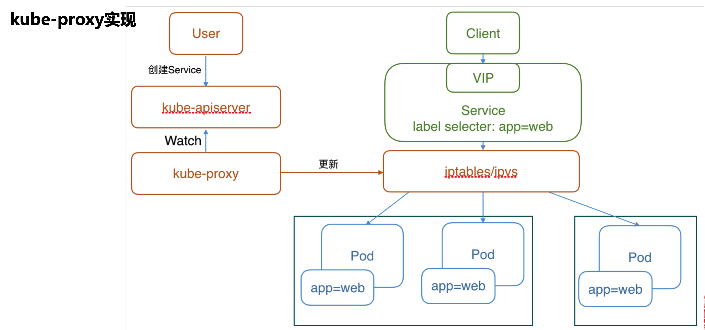

# Service
## Introduction
Service 是应用服务的抽象，通过 labels 为应用提供负载均衡和服务发现。匹配 labels 的 Pod IP 和端口列表组成 endpoints，由 kube-proxy 负责将服务 IP 负载均衡到这些 endpoints 上。每个 Service 都会自动分配一个 cluster IP（仅在集群内部可访问的虚拟地址）和 DNS 名，其他容器可以通过该地址或 DNS 来访问服务，而不需要了解后端容器的运行。

Service的主要作用是作为Pod的代理入口，从而代替Pod对外暴露一个固定的网络地址。K8s之所以需要Service，一方面是因为Pod的 IP不是固定的，另一方面则是因为一组Pod实例之间总会有负载均衡的需求。

被Service的selector 选中的 Pod，就称为 Service 的 Endpoints，你可以使用 kubectl get ep 命令看到它们。只有处于 Running 状态，且 readinessProbe 检查通过的 Pod，才会出现在 Service 的 Endpoints 列表里。并且，当某一个 Pod 出现问题时，k8s 会自动把它从 Service 里摘除掉。

### IP & Port
- IP
  - podIP: each pod's IP
  - clusterIP: each service's IP (on the clusterIP mode) 
  - nodeIP: hosting server IP
- Port
  - containerPort: container's exposed port
  - targetPort: 容器/Pod用到的端口，`<pod-ip>:targetPort`
  - port: Service用到的端口，`<cluster-ip>:port`
  - nodePort: node用到的端口，`<node-ip>:nodePort`
- Network Mode
  - clusterIP: 
  - nodePort: 

### 实现原理

Service 是由 kube-proxy 组件，加上 iptables 来共同实现的。



kube-proxy 就可以通过 Service 的 Informer 感知到这样一个 Service 对象的添加。而作为对这个事件的响应，它就会在宿主机上创建这样一条 iptables 规则

```bash
-A KUBE-SERVICES -d 10.0.1.175/32 -p tcp -m comment --comment "default/hostnames: cluster IP" -m tcp --dport 80 -j KUBE-SVC-NWV5X2332I4OT4T3
```

这条 iptables 规则的含义是：凡是目的地址是 10.0.1.175（Service的VIP）、目的端口是 80 的 IP 包，都应该跳转到另外一条名叫 KUBE-SVC-NWV5X2332I4OT4T3的 iptables 链进行处理。

```bash
-A KUBE-SVC-NWV5X2332I4OT4T3 -m comment --comment "default/hostnames:" -m statistic --mode random --probability 0.33332999982 -j KUBE-SEP-WNBA2IHDGP2BOBGZ
-A KUBE-SVC-NWV5X2332I4OT4T3 -m comment --comment "default/hostnames:" -m statistic --mode random --probability 0.50000000000 -j KUBE-SEP-X3P2623AGDH6CDF3
-A KUBE-SVC-NWV5X2332I4OT4T3 -m comment --comment "default/hostnames:" -j KUBE-SEP-57KPRZ3JQVENLNBR
```

KUBE-SVC-NWV5X2332I4OT4T3 规则是3条规则的集合，这三条链指向的最终目的地，其实就是这个 Service 代理的三个 Pod。所以这一组规则，就是 Service 实现负载均衡的位置。

```bash
-A KUBE-SEP-57KPRZ3JQVENLNBR -s 10.244.3.6/32 -m comment --comment "default/hostnames:" -j MARK --set-xmark 0x00004000/0x00004000
-A KUBE-SEP-57KPRZ3JQVENLNBR -p tcp -m comment --comment "default/hostnames:" -m tcp -j DNAT --to-destination 10.244.3.6:9376

-A KUBE-SEP-WNBA2IHDGP2BOBGZ -s 10.244.1.7/32 -m comment --comment "default/hostnames:" -j MARK --set-xmark 0x00004000/0x00004000
-A KUBE-SEP-WNBA2IHDGP2BOBGZ -p tcp -m comment --comment "default/hostnames:" -m tcp -j DNAT --to-destination 10.244.1.7:9376

-A KUBE-SEP-X3P2623AGDH6CDF3 -s 10.244.2.3/32 -m comment --comment "default/hostnames:" -j MARK --set-xmark 0x00004000/0x00004000
-A KUBE-SEP-X3P2623AGDH6CDF3 -p tcp -m comment --comment "default/hostnames:" -m tcp -j DNAT --to-destination 10.244.2.3:9376
```

这三条链，其实是三条 DNAT 规则。而 DNAT 规则的作用，就是在 PREROUTING 检查点之前，也就是在路由之前，将流入 IP 包的目的地址和端口，改成–to-destination 所指定的新的目的地址和端口。可以看到，这个目的地址和端口，正是被代理 Pod 的 IP 地址和端口。这样，访问 Service VIP 的 IP 包经过上述 iptables 处理之后，就已经变成了访问具体某一个后端 Pod 的 IP 包了。这些 Endpoints 对应的 iptables 规则，正是 kube-proxy 通过监听 Pod 的变化事件，在宿主机上生成并维护的。

但 Service 的访问在 k8s 集群之外是无效的。所谓 Service 的访问入口，其实就是每台宿主机上由 kube-proxy 生成的 iptables 规则，以及 kube-dns 生成的 DNS 记录。而一旦离开了这个集群，这些信息对用户来说，也就自然没有作用了。


### IPVS

IPVS 模式的工作原理，其实跟 iptables 模式类似。当我们创建了前面的 Service 之后，kube-proxy 首先会在宿主机上创建一个虚拟网卡（叫作：kube-ipvs0），并为它分配 Service VIP 作为 IP 地址。而接下来，kube-proxy 就会通过 Linux 的 IPVS 模块，为Pod的3个 IP 地址设置三个 IPVS 虚拟主机，并设置这三个虚拟主机之间使用轮询模式 (rr) 来作为负载均衡策略。


## 类型

### ClusterIP
Only for the k8s cluster access

### NodePort

如果你不显式地声明 nodePort 字段，ks8 就会为你分配随机的可用端口来设置代理。这个端口的范围默认是 30000-32767

对于NodePort，kube-proxy 要做的就是在每台宿主机上生成这样一条 iptables 规则：

```bash
-A KUBE-POSTROUTING -m comment --comment "kubernetes service traffic requiring SNAT" -m mark --mark 0x4000/0x4000 -j MASQUERADE
```

### ExternalName

### ExternalIPs


## CMD
- list service
  - `kubectl get services`: list services
  - `kubectl get services SVC_ID`: list a service
- describe services
  - `kubectl describe services`
  - `kubectl describe services SVC_ID`: describe a service
- create a service
  - `kubectl expose deployment DEP_ID --type NodePort --port 8080`: expose a deployment
    - `curl NODE_IP:NODE_PORT`: test
  - `kubectl apply -f svc1.yaml`: create a service from a YAML file
- delete a service
  - `kubectl delete service SVC_ID`
  - `kubectl delete service -l name=label`: delete a service by label
- list endpoints
  - `kubectl get endpoints`
  - `kubectl get endpoints SVR_ID`


## Labs
### NodePort
- `kubectl apply -f service1.yaml`: create a service from a YAML file
- `kubectl get svc`: get the random node_port
- `curl nodeIp:nodePort`: it works, even with *Docker-for-Desktop*

### ClusterIP
- `kubectl apply -f service2.yaml`
- `kubectl get svc`: get the clusterIP and port of the service
- `curl clusterIP:clusterPort`: test **ping clusterIP doesnt' work, clusterIP should be bind with port**

### Service CMD for Pod
- `kubectl apply -f service3-pod.yaml`
- `kubectl expose pod pod-service3 --type=NodePort --target-port=80 --port=8888`: the node port will be created automatically
- `curl nodeIP:nodePort`

### Health Check
如果没有health check，有些服务会报错
- `kubectl apply -f service4-health-check.yaml`
- `kubectl expose deployment service4-dep-health-check`
- `kubectl get service`
- `curl 10.109.21.81:8080`

### External Service
A service *without label-selector* is supposed to connect to an external service through a manually create endpoint. 
- `kubectl create -f endpoints.yaml`
- `kubectl create -f service5-endpoints.yaml`
- `kubectl get endpoints`: list
- `kubectl descrbe endpoints service5-endpoints`: ep use the same name as svc

### Headless Service
*Without clusterIP*, a service maps directly to pod endpoints.
It uses only label selector to return backend endpoint list.  
- `kubectl create -f svc-headless.yaml`
- `kubectl describe svc svc-headless`
